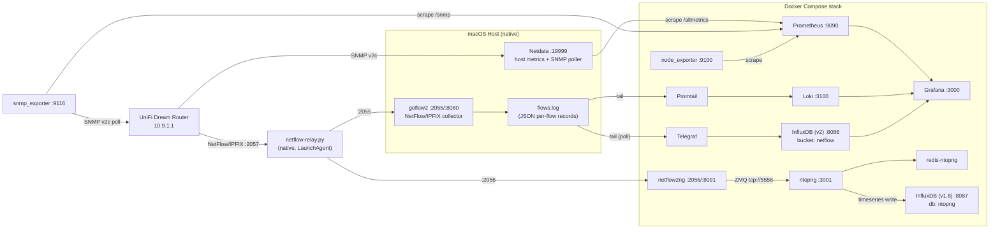

# docker-monitoring

A local observability stack for macOS host metrics, a UniFi Dream Router (SNMP + NetFlow/IPFIX), and general infrastructure monitoring — built on Prometheus, Grafana, Loki, InfluxDB, and ntopng.

## Architecture
There are currently two parallel NetFlow collection paths: the original goflow2 → Loki/InfluxDB(v2) pipeline (per-flow log records, queried via LogQL/InfluxQL) and a newer netflow2ng → ntopng pipeline (live ZMQ flow stream, browsable traffic dashboard with its own historical timeseries store). Both can run side by side since the router can export NetFlow to multiple collector ports.


## Services

| Service | Image | Port | Purpose |
|---|---|---|---|
| `prometheus` | `prom/prometheus` | 9090 | Scrapes Netdata, node_exporter, snmp_exporter |
| `grafana` | `grafana/grafana` | 3000 | Dashboards (provisioned from files) |
| `node_exporter` | `prom/node-exporter` | 9100 | Host metrics — **caveat: reports Docker Desktop's internal Linux VM, not real macOS** |
| `snmp_exporter` | `prom/snmp-exporter` | 9116 | Standard IF-MIB metrics for the router via SNMPv2c |
| `loki` | `grafana/loki` | 3100 | Log storage for raw flow records |
| `promtail` | `grafana/promtail` | 9080 | Tails `flows.log`, ships to Loki |
| `influxdb` | `influxdb:2` | 8086 | Time-series store for per-flow records (bucket `netflow`, org `netmon`) |
| `telegraf` | `telegraf` | — | Tails `flows.log`, parses JSON, writes points to InfluxDB |
| `netflow2ng` | `synfinatic/netflow2ng` | 2056 (udp), 8091 | Receives NetFlow/IPFIX, republishes flows to ntopng over ZMQ |
| `ntopng` | `ntop/ntopng` | 3001 | Live traffic dashboard fed by netflow2ng; local networks: `10.9.1.0/24,192.168.3.0/24` |
| `redis-ntopng` | `redis:alpine` | — | Dedicated Redis instance for ntopng's cache/preferences |
| `influxdb-ntopng` | `influxdb:1.8` | 8087 | Dedicated InfluxDB 1.x instance for ntopng's Timeseries driver (db: `ntopng`). ntopng only supports InfluxDB 1.x, so it cannot share the v2 `influxdb` container above |

Three components run natively on the host (not in Docker), since they need direct macOS/network access:
- **Netdata** (Homebrew, `/opt/homebrew/etc/netdata/`) — real host metrics (CPU, RAM, disk, GPU, battery) plus the `go.d/snmp` collector polling the router.
- **goflow2** (`~/bin/goflow2`, managed via LaunchAgent `~/Library/LaunchAgents/com.netsampler.goflow2.plist`) — receives NetFlow/IPFIX on UDP `2055`, writes JSON records to `~/Library/Logs/goflow2/flows.log`, and exposes internal Prometheus metrics on `:8080`.
- **netflow-relay.py** (`scripts/netflow-relay.py`, managed via LaunchAgent `~/Library/LaunchAgents/com.netmon.netflow-relay.plist`) — receives the router's single NetFlow export on UDP `2057` and duplicates each packet to both goflow2 (`2055`) and netflow2ng (`2056`), since the router only supports one export target but two collectors need the data.

## Prerequisites

- Docker Desktop (context `desktop-linux`)
- Homebrew, with `netdata` installed and running (`brew services start netdata`)
- `goflow2` binary running as a LaunchAgent, listening on UDP `2055`
- `scripts/netflow-relay.py` running as a LaunchAgent, listening on UDP `2057`
- Router configured to export SNMP (v2c, community `public`) and NetFlow/IPFIX to this Mac's LAN IP on port `2057` (the relay, not directly to goflow2 or netflow2ng)

## Deployment

```zsh
cd ~/docker-monitoring
docker compose up -d
```

This brings up all 8 containers. Grafana auto-provisions its data sources and dashboards from files on every start — no manual UI setup is required.

Access points:
- Grafana: http://localhost:3000 (`admin` / `admin` — change on first login)
- Prometheus: http://localhost:9090
- InfluxDB UI: http://localhost:8086
- Netdata: http://localhost:19999
- ntopng: http://localhost:3001 (login disabled)

## Configuration reference

| File | Purpose |
|---|---|
| `docker-compose.yml` | All container definitions, networking, volumes |
| `prometheus/prometheus.yml` | Scrape jobs: `node_exporter`, `prometheus`, `netdata`, `netdata_snmp_gateway`, `snmp_exporter_gateway` |
| `promtail/promtail-config.yml` | Tails `flows.log`, extracts `type`/`proto` as labels and other fields (`src_addr`, `dst_addr`, ports, `in_if`/`out_if`) as parsed fields for LogQL |
| `telegraf/telegraf.conf` | Tails `flows.log` (poll mode — required for Docker Desktop bind mounts), writes tagged points to InfluxDB |
| `grafana/provisioning/datasources/datasources.yml` | Prometheus, Loki, InfluxDB (netflow, v2/Flux), InfluxDB (ntopng, v1/InfluxQL) data source definitions (fixed UIDs, referenced by dashboard JSON) |
| `grafana/provisioning/dashboards/dashboards.yml` | Points Grafana at `grafana/dashboards/` for auto-loading |
| `grafana/dashboards/*.json` | The 8 dashboards (source of truth — edit these, not via UI, for changes to survive a volume wipe) |
| `scripts/netflow-relay.py` | UDP fan-out relay (LaunchAgent `com.netmon.netflow-relay.plist`) duplicating the router's single NetFlow export to both goflow2 and netflow2ng |

### Dashboards

| Dashboard | Data source | Content |
|---|---|---|
| Netdata Host Metrics (macOS) | Prometheus | CPU/RAM/Load quick overview |
| Netdata Full (macOS Host) | Prometheus | CPU, memory, swap, disk, network, GPU, battery |
| Node Exporter Full | Prometheus | Community dashboard (ID 1860) — reflects the Docker Desktop VM, not the real Mac |
| SNMP Exporter - Gateway | Prometheus | Standard IF-MIB metrics (`ifOperStatus`, `ifHCInOctets`, etc.) via `snmp_exporter` |
| NetFlow/IPFIX Live (Router) | Prometheus | Aggregate goflow2 counters re-exposed via Netdata's prometheus proxy |
| NetFlow Rich Detail | Loki | Per-flow LogQL time series grouped by port/IP/interface + raw log stream |
| NetFlow (InfluxDB) | InfluxDB (netflow, v2/Flux) | Proper time-series panels (bars/lines) grouped by port/IP/interface, backed by real point storage |
| ntopng - Flows, Hosts & Traffic (InfluxDB) | InfluxDB (ntopng, v1/InfluxQL) | Active/local host counts, active/new flows, bytes by L4 protocol, ASN, and country, TCP anomalies, ntopng CPU load |

## Maintenance

### Updating a dashboard
Edit the corresponding file in `grafana/dashboards/`, then either wait up to 30s (`updateIntervalSeconds` in `dashboards.yml`) or restart Grafana:
```zsh
docker compose restart grafana
```
Avoid editing dashboards via the Grafana UI — changes made there are not saved back to these files and will be lost on a volume wipe unless exported and copied back manually.

### Adding a new Prometheus scrape target
Edit `prometheus/prometheus.yml`, then reload without a full restart:
```zsh
docker kill --signal=HUP prometheus
```

### Adding a new SNMP-monitored device
Add a job to `/opt/homebrew/etc/netdata/go.d/snmp.conf` (native Netdata) and/or a target in the `snmp_exporter_gateway` job in `prometheus/prometheus.yml`, then restart the relevant service (`brew services restart netdata`, or `docker kill --signal=HUP prometheus`).

### Full stack restart (proven persistent)
```zsh
docker compose down    # removes containers, keeps named volumes
docker compose up -d   # recreates everything from config files
```

### Configuring ntopng's Timeseries driver (InfluxDB)
By default ntopng stores historical timeseries locally as RRD files. This stack instead points it at the dedicated `influxdb-ntopng` container, via the web UI (Preferences → Timeseries): **Timeseries Driver**: `InfluxDB 1.x`, **InfluxDB URL**: `http://influxdb-ntopng:8086`, **InfluxDB Database**: `ntopng`, authentication disabled. Under the hood this sets two Redis keys read by `ts_utils_core.lua`/`influxdb.lua`:
- `ntopng.prefs.timeseries_driver` = `influxdb`
- `ntopng.prefs.ts_post_data_url` = `http://influxdb-ntopng:8086`

These preferences live in `redis-ntopng` (not a file in this repo), so they aren't provisioned automatically like Grafana's dashboards and must be re-applied if the `redis-ntopng` volume is ever wiped. ntopng caches its active timeseries driver in memory, so a container restart (`docker restart ntopng`) is needed after changing it for the change to take effect.

Verify ingestion with:
```zsh
docker exec influxdb-ntopng influx -database ntopng -execute "SHOW MEASUREMENTS"
docker exec influxdb-ntopng influx -database ntopng -execute 'SELECT * FROM "iface:local_hosts" ORDER BY time DESC LIMIT 3'
```
Confirmed working: ntopng auto-created its retention policies/continuous queries on first save ("InfluxDB CQ migration completed"), `influxdb-ntopng` logs show `POST /write` returning `204`, and measurements such as `iface:local_hosts`, `iface:hosts`, `iface:flows`, `asn:*`, `country:*`, and `system:cpu_load` contain real data points. This is now visualized in Grafana via the "ntopng - Flows, Hosts & Traffic (InfluxDB)" dashboard, backed by the `InfluxDB-ntopng` datasource (InfluxQL mode, `grafana/provisioning/datasources/datasources.yml`).

### Rebuilding Grafana from scratch (disaster recovery test)
```zsh
docker compose stop grafana
docker compose rm -f grafana
docker volume rm docker-monitoring_grafana_data
docker compose up -d grafana
```
Datasources and dashboards will re-provision automatically from the files in `grafana/`.

### Version control
This directory is a git repository. Commit any config changes:
```zsh
git add -A && git commit -m "describe the change"
```

## Known limitations

- **node_exporter metrics reflect Docker Desktop's LinuxKit VM**, not the real Mac (Docker containers can't access macOS `/proc`/`/sys`). Use the Netdata-backed dashboards for real host metrics.
- **ICMP ping sub-checks fail** in Netdata's SNMP collector logs (`operation not permitted`) — macOS restricts raw ICMP sockets for unprivileged processes. This only disables the optional ping-latency chart; SNMP metric collection is unaffected.
- **goflow2 counters reset on process restart** (LaunchAgent `KeepAlive` will restart it on crash). If flow dashboards suddenly go empty, check `~/Library/Logs/goflow2/stderr.log` and confirm the router is still sending flows to this Mac's current LAN IP (it can change on DHCP renewal).
- **Telegraf requires `watch_method = "poll"`** for the `inputs.tail` plugin — inotify events don't reliably cross the Docker Desktop macOS bind-mount bridge.
- **ntopng only supports InfluxDB 1.x**, not the 2.x API used by the main `influxdb` container. A separate `influxdb-ntopng` (1.8) container exists solely for ntopng's timeseries data — don't point ntopng at the v2 `influxdb` container directly.
- **ntopng's `--local-networks` only affects host classification** (local vs. remote), not which flows are received. If the router isn't exporting NetFlow for a given VLAN/subnet to netflow2ng's port, adding that subnet to `--local-networks` won't make its traffic appear.
- **ntopng preferences (Timeseries driver, local networks changes made via UI, etc.) live in `redis-ntopng`**, not in a file under this repo, so they are not version-controlled and won't survive `docker volume rm` on `redis-ntopng`'s data unless re-applied manually.
- **`--disable-login` requires an explicit mode argument (`0` or `1`)** in the `ntopng` command list in `docker-compose.yml`. Omitting it causes ntopng's argument parser to consume the *next* list item as the mode value instead — e.g. it previously swallowed `--local-networks` itself, silently discarding local-network classification (symptom: "No local hosts detected" despite active traffic) and leaving login enabled. Always keep `"1"` as its own list entry immediately after `"--disable-login"`.
- **The UniFi router's NetFlow exporter only supports a single destination IP:port.** With both goflow2 (`2055`) and netflow2ng (`2056`) needing the same flow data, the router is instead pointed at `scripts/netflow-relay.py` (port `2057`), which duplicates every datagram to both. If flows stop reaching one or both pipelines, check `launchctl list | grep netflow-relay` and the logs in `~/Library/Logs/netflow-relay/`.
- **The ntopng InfluxDB datasource uses InfluxQL (v1.x), not Flux** — unlike the main `InfluxDB-NetFlow` datasource. Dashboard panel queries use the classic `{"query": "SELECT ...", "rawQuery": true}` target format, not Flux syntax.
