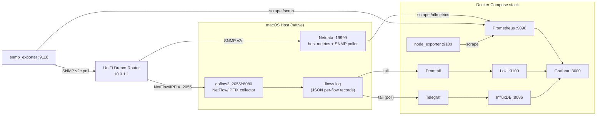

# docker-monitoring

A local observability stack for macOS host metrics, a UniFi Dream Router (SNMP + NetFlow/IPFIX), and general infrastructure monitoring — built on Prometheus, Grafana, Loki, and InfluxDB.

## Architecture



## Services

| Service | Image | Port | Purpose |
|---|---|---|---|
| `prometheus` | `prom/prometheus` | 9090 | Scrapes Netdata, node_exporter, snmp_exporter |
| `grafana` | `grafana/grafana` | 3000 | Dashboards (provisioned from files) |
| `node_exporter` | `prom/node-exporter` | 9100 | Host metrics — **caveat: reports Docker Desktop's internal Linux VM, not real macOS** |
| `snmp_exporter` | `prom/snmp-exporter` | 9116 | Standard IF-MIB metrics for the router via SNMPv2c |
| `loki` | `grafana/loki` | 3100 | Log storage for raw flow records |
| `promtail` | `grafana/promtail` | 9080 | Tails `flows.log`, ships to Loki |
| `influxdb` | `influxdb:2` | 8086 | Time-series store for per-flow records (bucket `netflow`, org `netmon`) |
| `telegraf` | `telegraf` | — | Tails `flows.log`, parses JSON, writes points to InfluxDB |

Two components run natively on the host (not in Docker), since they need direct macOS/network access:
- **Netdata** (Homebrew, `/opt/homebrew/etc/netdata/`) — real host metrics (CPU, RAM, disk, GPU, battery) plus the `go.d/snmp` collector polling the router.
- **goflow2** (`~/bin/goflow2`, managed via LaunchAgent `~/Library/LaunchAgents/com.netsampler.goflow2.plist`) — receives NetFlow/IPFIX from the router on UDP `2055`, writes JSON records to `~/Library/Logs/goflow2/flows.log`, and exposes internal Prometheus metrics on `:8080`.

## Prerequisites

- Docker Desktop (context `desktop-linux`)
- Homebrew, with `netdata` installed and running (`brew services start netdata`)
- `goflow2` binary running as a LaunchAgent, listening on UDP `2055`
- Router configured to export SNMP (v2c, community `public`) and NetFlow/IPFIX to this Mac's LAN IP on port `2055`

## Deployment

```zsh
cd ~/docker-monitoring
docker compose up -d
```

This brings up all 8 containers. Grafana auto-provisions its data sources and dashboards from files on every start — no manual UI setup is required.

Access points:
- Grafana: http://localhost:3000 (`admin` / `admin` — change on first login)
- Prometheus: http://localhost:9090
- InfluxDB UI: http://localhost:8086
- Netdata: http://localhost:19999

## Configuration reference

| File | Purpose |
|---|---|
| `docker-compose.yml` | All container definitions, networking, volumes |
| `prometheus/prometheus.yml` | Scrape jobs: `node_exporter`, `prometheus`, `netdata`, `netdata_snmp_gateway`, `snmp_exporter_gateway` |
| `promtail/promtail-config.yml` | Tails `flows.log`, extracts `type`/`proto` as labels and other fields (`src_addr`, `dst_addr`, ports, `in_if`/`out_if`) as parsed fields for LogQL |
| `telegraf/telegraf.conf` | Tails `flows.log` (poll mode — required for Docker Desktop bind mounts), writes tagged points to InfluxDB |
| `grafana/provisioning/datasources/datasources.yml` | Prometheus, Loki, InfluxDB data source definitions (fixed UIDs, referenced by dashboard JSON) |
| `grafana/provisioning/dashboards/dashboards.yml` | Points Grafana at `grafana/dashboards/` for auto-loading |
| `grafana/dashboards/*.json` | The 7 dashboards (source of truth — edit these, not via UI, for changes to survive a volume wipe) |

### Dashboards

| Dashboard | Data source | Content |
|---|---|---|
| Netdata Host Metrics (macOS) | Prometheus | CPU/RAM/Load quick overview |
| Netdata Full (macOS Host) | Prometheus | CPU, memory, swap, disk, network, GPU, battery |
| Node Exporter Full | Prometheus | Community dashboard (ID 1860) — reflects the Docker Desktop VM, not the real Mac |
| SNMP Exporter - Gateway | Prometheus | Standard IF-MIB metrics (`ifOperStatus`, `ifHCInOctets`, etc.) via `snmp_exporter` |
| NetFlow/IPFIX Live (Router) | Prometheus | Aggregate goflow2 counters re-exposed via Netdata's prometheus proxy |
| NetFlow Rich Detail | Loki | Per-flow LogQL time series grouped by port/IP/interface + raw log stream |
| NetFlow (InfluxDB) | InfluxDB | Proper time-series panels (bars/lines) grouped by port/IP/interface, backed by real point storage |

## Maintenance

### Updating a dashboard
Edit the corresponding file in `grafana/dashboards/`, then either wait up to 30s (`updateIntervalSeconds` in `dashboards.yml`) or restart Grafana:
```zsh
docker compose restart grafana
```
Avoid editing dashboards via the Grafana UI — changes made there are not saved back to these files and will be lost on a volume wipe unless exported and copied back manually.

### Adding a new Prometheus scrape target
Edit `prometheus/prometheus.yml`, then reload without a full restart:
```zsh
docker kill --signal=HUP prometheus
```

### Adding a new SNMP-monitored device
Add a job to `/opt/homebrew/etc/netdata/go.d/snmp.conf` (native Netdata) and/or a target in the `snmp_exporter_gateway` job in `prometheus/prometheus.yml`, then restart the relevant service (`brew services restart netdata`, or `docker kill --signal=HUP prometheus`).

### Full stack restart (proven persistent)
```zsh
docker compose down    # removes containers, keeps named volumes
docker compose up -d   # recreates everything from config files
```

### Rebuilding Grafana from scratch (disaster recovery test)
```zsh
docker compose stop grafana
docker compose rm -f grafana
docker volume rm docker-monitoring_grafana_data
docker compose up -d grafana
```
Datasources and dashboards will re-provision automatically from the files in `grafana/`.

### Version control
This directory is a git repository. Commit any config changes:
```zsh
git add -A && git commit -m "describe the change"
```

## Known limitations

- **node_exporter metrics reflect Docker Desktop's LinuxKit VM**, not the real Mac (Docker containers can't access macOS `/proc`/`/sys`). Use the Netdata-backed dashboards for real host metrics.
- **ICMP ping sub-checks fail** in Netdata's SNMP collector logs (`operation not permitted`) — macOS restricts raw ICMP sockets for unprivileged processes. This only disables the optional ping-latency chart; SNMP metric collection is unaffected.
- **goflow2 counters reset on process restart** (LaunchAgent `KeepAlive` will restart it on crash). If flow dashboards suddenly go empty, check `~/Library/Logs/goflow2/stderr.log` and confirm the router is still sending flows to this Mac's current LAN IP (it can change on DHCP renewal).
- **Telegraf requires `watch_method = "poll"`** for the `inputs.tail` plugin — inotify events don't reliably cross the Docker Desktop macOS bind-mount bridge.
